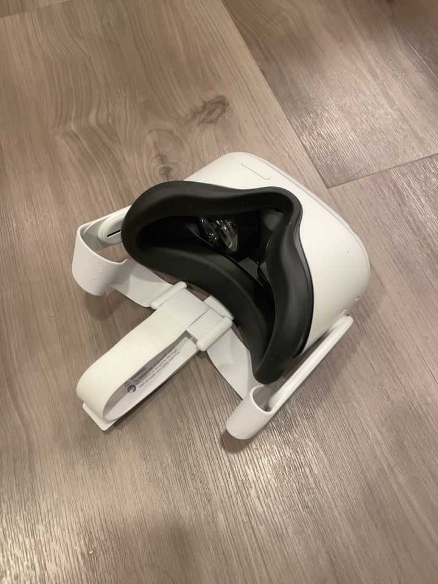

# Multiview Compressive Coding for 3D Reconstruction
[Chao-Yuan Wu](https://chaoyuan.org/), 
[Justin Johnson](https://web.eecs.umich.edu/~justincj/),
[Jitendra Malik](https://people.eecs.berkeley.edu/~malik/),
[Christoph Feichntenhofer](https://feichtenhofer.github.io/),
[Georgia Gkioxari](https://gkioxari.github.io/)
  
### [[Paper]](https://arxiv.org/abs/2301.08247) [[Project Page]](https://mcc3d.github.io/) ###

<video controls autoplay src="https://user-images.githubusercontent.com/1841547/213249405-a9052b5c-08e6-44ce-9140-35e0063a3fa4.mp4" controls="controls" style="max-width: 730px;"></video>


This is a PyTorch implementation of [Multiview Compressive Coding (MCC)](https://arxiv.org/abs/2301.08247):
```
@article{wu2023multiview,
  author    = {Wu, Chao-Yuan and Johnson, Justin and Malik, Jitendra and Feichtenhofer, Christoph and Gkioxari, Georgia},
  title     = {Multiview Compressive Coding for 3{D} Reconstruction},
  journal   = {arXiv preprint arXiv:2301.08247},
  year      = {2023},
}
```

## Installation
This repo is a modified from [the MAE repo](https://github.com/facebookresearch/mae). Installation and preparation follow that repo.
Please also install [PyTorch3D](https://pytorch3d.org/) for 3D related funcionality.

```
pip install h5py omegaconf submitit
```

## Data
Please see [DATASET.md](DATASET.md) for information on data preparation.

## Running MCC on CO3D v2
To train an MCC model on [the CO3D v2 dataset](https://ai.facebook.com/datasets/CO3D-dataset/), please run
```
python submitit_mcc.py \
    --use_volta32 \
    --job_dir ./output \
    --nodes 4 \
    --co3d_path [path to CO3D dataset] \
    --resume [path to pretrained weights for RGB encoder (optional)] \
    --holdout_categories \
```
- With `--holdout_categories`, we hold out a subset of categories during training, and evaluate on the held out categories only.
To train on all categories, please remove the argument.
- Here we use 4 nodes (machines) by default; Users may use a different value.
- Optional: The RGB encoder may be initialized by a pre-trained image model. An ImageNet1K-MAE-pretrained model is available [[here](https://dl.fbaipublicfiles.com/MCC/vit_base_IN1K.pth)]. Using a pre-trained model may speed up training but does not affect the final results much.

## Running MCC on Hypersim
To train an MCC model on [the Hypersim dataset](https://github.com/apple/ml-hypersim), please run
```
python submitit_mcc.py \
    --use_volta32 \
    --job_dir ./output \
    --nodes 4 \
    --hypersim_path [path to Hypersim dataset] \
    --resume [path to pretrained weights for RGB encoder (optional)] \
    --use_hypersim \
    --viz_granularity 0.2 --eval_granularity 0.2 \
    --blr 5e-5 \
    --epochs 50 \
    --train_epoch_len_multiplier 3200 \
    --eval_epoch_len_multiplier 200 \
```
- Here we additionally specify `--use_hypersim` for running Hypersim scene reconstruction experiments.
- We use slightly different hyperparameters to accommodate the scene reconstruction task.

## Testing on iPhone captures
To test on iPhone captures, please use the [Record3D](https://record3d.app/) App on an iPhone to capture an RGB image and the corresonding point cloud (.obj) file. To generate the segmentation mask, we used a private segmentation model; Users may use other tools/models to obtain the mask. Two example captures are available in the `demo` folder. 
<div align="center">
  
</div>

To run MCC inference on the example, please use, e.g., 
```
python demo.py --image demo/quest2.jpg --point_cloud demo/quest2.obj --seg demo/quest2_seg.png \
--checkpoint [path to model checkpoint] \
```
One may use a checkpoint from the training step above or download a model that is already trained on all CO3D v2 categories [[here](https://dl.fbaipublicfiles.com/MCC/co3dv2_all_categories.pth)].
One may set the `--score_thresholds` argument to specify the score thresholds (More points are shown with a lower threshold, but the predictions might be noisier). 
The script will generate an html file showing an interactive visualizaion of the MCC output with [plotly](https://plotly.com/).
<div align="center">

</div>


## Acknowledgement
Part of this implementation is based on the [MAE](https://github.com/facebookresearch/mae) codebase. We thank [Sasha Sax](https://alexsax.github.io/) for help on loading Hypersim and Taskonomy data.

## License
Multiview Compressive Coding is released under the [CC-BY-NC 4.0](LICENSE).
